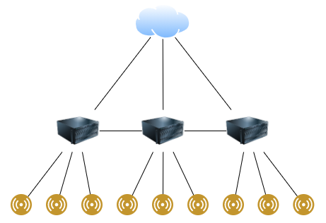
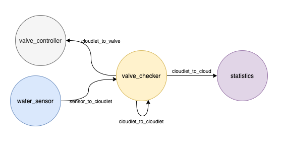
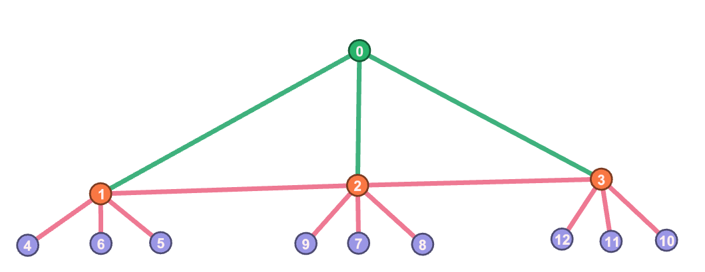
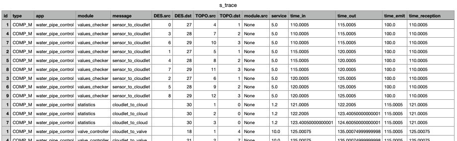
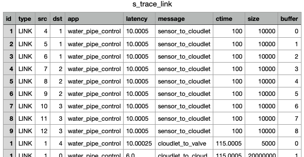

<div style="text-align: justify">

# Water Pipe Control

## Scenario
Let's suppose we need to control a water pipe, with a lot of sensor measuring something (for example water velocity or pressure) with the aim of controlling valve along the pipe.

In this scenario we have 9 sensors, periodically sending messages to 3 cloudlet, connected with each other, near the pipe. The cloudlets then send one or more messages occasionally just for an overall monitoring (much more rarely).

The mean of the cloudlet is to immediately controlling the valve along the pipe after executing some sort of check of values provided by the sensors, avoiding latency due to the large physical distance from the cloud.

### Topology (topology_definition.json)

The topology will be something like this<br>
<div style="text-align: center">


</div>

Cloudlets are interconnected to forward messages if necessary. Sensors and valve are located into the same hardware.

### Application (data/app_definition.json)

In this simulation there will be only one application, composed by four modules:<br>
1. A module located into cloudlet for values check
   ```
    {
        "id": 0,
        "name": "values_checker"
    }
   ```
1. A module located into the valve/sensor hardware for valve control
   ```
   {
       "id": 1,
        "name": "valve_controller"
   }
   ```
1. A module located into the valve/sensor hardware for values sending
   ```
   {
       "id": 2,
       "name": "water_sensor"
   }
   ```
2. A module for the requests exchange between cloudlets and the cloud
   ```
   {
       "id": 3,
       "name": "statistics"
   }
   ```

### Messages

As said before there will be different messages exchange. Some will be functional (from cloudlet to sensor, i.e values measured, and viceversa, i.e command to valve) and other will be statistcal (from cloudlet to cloud, i.e general statistical information).

Message with sensor values:
```
{
    "id": 0,
    "name": "sensor_to_cloudlet",
    "s": "None",
    "d": "values_checker",
    "bytes": 10000,
    "instructions": 5000
}
```

Message with valve action (e.g close, open, etc.):
```
{
    "id": 1,
    "name": "cloudlet_to_valve",
    "s": "None",
    "d": "valve_controller",
    "bytes": 5000,
    "instructions": 1000
}
```

Message with valve action between cloudlets:
```
{
    "id": 2,
    "name": "cloudlet_to_cloudlet",
    "s": "None",
    "d": "values_checker",
    "bytes": 5000,
    "instructions": 1000
}
```

Message with statistical information (e.g about water levels)
```
{
    "id": 3,
    "name": "cloudlet_to_cloud",
    "s": "None",
    "d": "statistics",
    "bytes": 20000000,
    "instructions": 6000
}
```

To make sure that also the water sensors get activated I need to add the following message:
```
    {
        "id": 4,
        "name": "activation",
        "s": "None",
        "d": "water_sensor",
        "bytes": 1,
        "instructions": 1
    }
```

### Transmission
Now let's define the transmission of messages along the network. (The probabilities specified are halfway randomly assigned).
When a sensor sends values to the cloudlet, we'll assume that the latter propagates the message to other cloudlet with a probability of 0.6. (2/3 of the remaining valve):
```
{
    "module": "values_checker",
    "message_in": "sensor_to_cloudlet",
    "message_out": "cloudlet_to_cloudlet",
    "fractional": 0.6
}
```
Also, when a cloudlet receives a value from sensors, it can respond with a valve action with a probability of 0.5:
```
{
    "module": "values_checker",
    "message_in": "sensor_to_cloudlet",
    "message_out": "cloudlet_to_valve",
    "fractional": 0.5
}
```
The cloud is contacted with only statistical messages and information very rarely,  with a probability of 0.1, after receiving water levels:
```
{
    "module": "values_checker",
    "message_in": "sensor_to_cloudlet",
    "message_out": "cloudlet_to_cloud",
    "fractional": 0.1
}
```
With the application having the following diagram:<br>
<div style="text-align: center">


</div>

We need to also define other modules receiving messages (to make sure that they get added to the application):
```
{
    "module": "valve_controller",
    "message_in": "cloudlet_to_valve"
},
{
    "module": "statistics",
    "message_in": "cloudlet_to_cloud"
},
{
    "module": "water_sensor",
    "message_in": "activation"
}
```

### Population (population_definition.json)

Those are the points on the network where the initial messages of and app are generated. As mentioned, everything starts from the water sensors sending water levels (or other information) to the cloudlet.

See population_definition.json.

### Modules Allocation (alloc_definition.json)

This defines where modules (i.e services) are located. Basically modules (or services) are located as follows:
- Water sensonrs and valve controller are located into the same device (for the sake of simplicity).
- Values_checker is located into cloudlets.
- Statistics is located into the cloud.

### Routing and orchestration

The routing algorithm used in the simulation is the yafs'DeviceSpeedAwareRouting. The devices follow the fastest route, as the result we want to achieve is the speed and avoiding latency.

## Results
The graph generated (visualization with Gephi) is:<br>
<div style="text-align: center">


</div>

On of the many simulation performed also produced two .csv files, one containing interactions between modules and the messages' processing time, ```s_trace.csv```:
<div style="text-align: center">


</div>

and the other containing information about messages' routing between modules over the network's links, ```s_trace_link.csv```:
<div style="text-align: center">


</div>